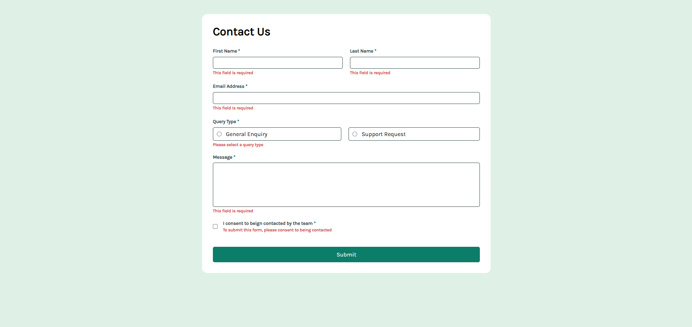

# Frontend Mentor - Contact form solution

This is a solution to the [Contact form challenge on Frontend Mentor](https://www.frontendmentor.io/challenges/contact-form--G-hYlqKJj). Frontend Mentor challenges help you improve your coding skills by building realistic projects.

## Table of contents

- [Overview](#overview)
  - [The challenge](#the-challenge)
  - [Screenshot](#screenshot)
  - [Links](#links)
- [My process](#my-process)
  - [Built with](#built-with)
  - [What I learned](#what-i-learned)
  - [Continued development](#continued-development)
- [Author](#author)
- [Acknowledgments](#acknowledgments)

## Overview

### The challenge

Users should be able to:

- Complete the form and see a success toast message upon successful submission
- Receive form validation messages if:
  - A required field has been missed
  - The email address is not formatted correctly
- Complete the form only using their keyboard
- Have inputs, error messages, and the success message announced on their screen reader
- View the optimal layout for the interface depending on their device's screen size
- See hover and focus states for all interactive elements on the page

### Screenshot

This screenshot shows the final version of my Contact Form solution. The project includes client-side validation using JavaScript, custom error messages, dynamic input states, and responsive behavior across different devices.

Interactive elements such as radio buttons, checkboxes, and input fields include proper focus and validation feedback to improve the overall user experience.

### Links

- Solution URL: [GitHub](https://github.com/yomidev/Form-Contact-Alert)
- Live Site URL: [GitHub Pages](https://yomidev.github.io/Form-Contact-Alert/)

## My process

### Built with

- Semantic HTML5 markup
- CSS custom properties
- Flexbox
- Mobile-first workflow
- Vanilla Javascript (form validation)

### What I learned

While building this project, I strengthened my understanding of form structure and client-side validation using pure JavaScript. Implementing custom validation logic allowed me to better understand how to handle user input, prevent default form submission, and dynamically display error messages.

I practiced DOM manipulation techniques such as selecting elements, traversing parent containers, adding and removing classes, and validating input values using regular expressions (especially for email validation).

Using Flexbox helped me structure the layout efficiently, particularly for grouping form fields and creating responsive radio button cards. I also gained experience handling focus states, error states, and improving overall user feedback through visual cues.

This project reinforced the importance of accessibility and usability when designing interactive forms.

### Continued development

In future projects, I would like to:

- Improve accessibility by adding ARIA attributes and enhancing screen reader support.
- Refactor validation logic into reusable functions for better scalability.
- Explore more advanced UI feedback patterns, such as custom toast notifications instead of alerts.
- Continue improving responsive design techniques for more complex layouts.

## Author

- Website - [Yomira Martínez](https://github.com/yomidev)
- Frontend Mentor - [@yomidev](https://www.frontendmentor.io/profile/yomidev)
- Twitter - [@yomimsm](https://x.com/yomimsm)

## Acknowledgments

Thanks to Frontend Mentor for creating this challenge and providing an excellent opportunity to practice frontend development skills.
